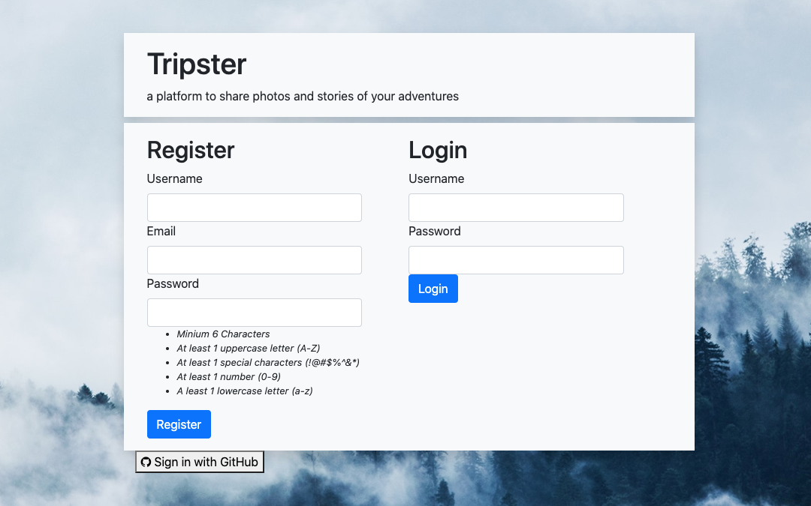
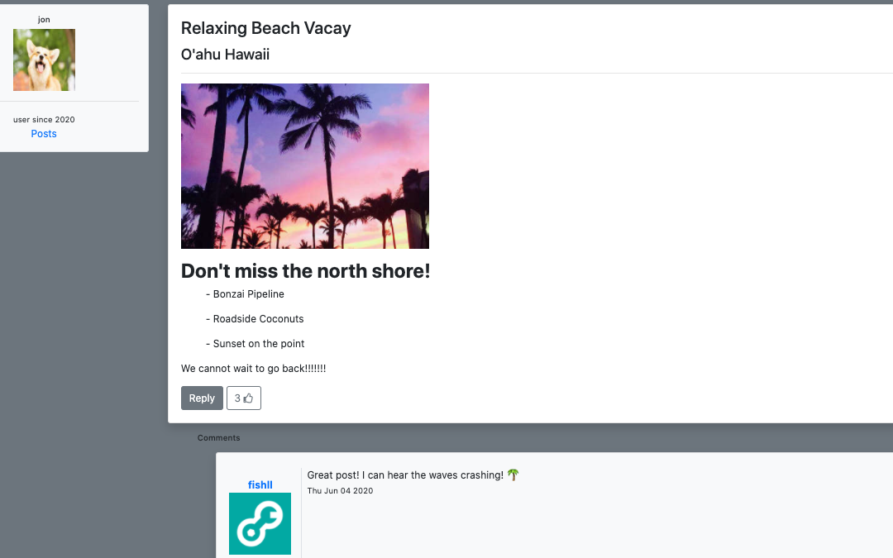
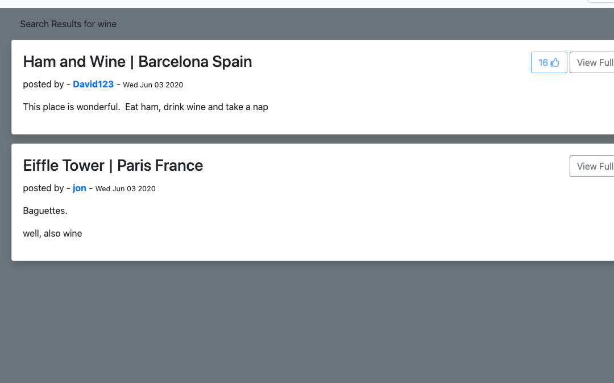

# Tripster
A mobile first full-stack web app designed to share your adventures.  Users first log in through our database or with a GitHub account.  Once verified the user is able to make a post about a location they've traveled to, comment on others journeys or browse by destination.  User data is stored in a postgrSQL database and served via Express.js
[View the app here](https://trippy-blog.herokuapp.com/)

## Developer Team
- Ying Hu - [LinkedIn](https://www.linkedin.com/in/yingx-hu/) - [GitHub](https://github.com/HuDaMan0621)
- Jack Skiles - [LinkedIn](https://www.linkedin.com/in/jack-skiles-46500a1a7/) - [GitHub](https://github.com/JackSkiles)
- Jonathan Cox - [LinkedIn](https://www.linkedin.com/in/jonathancox11/) - [GitHub](https://github.com/jonathancox1)

## Integrated Technologies
HTML5, CSS3, Bootstrap, Node.js, Express, PosgreSQL, oAuth2.0, Heroku

## Node Packages
Node, Express, Sequelize, Bcrypt, Passport, Cookie-Session, Multer, Jimp, EJS

## How to use Trippy
 - Begin by registering, or allow GitHub to authenticate you

    

 - Once authenticated, create a post about your travels!  Include a title, the location, a photo and your thoughts and tips on traveling to this destination.   Trippy will automatically handle resizing your image to a suitable size.

    

 - Upon submission, you will be redirected to your Homepage.  Here the latest posts are displayed.  You can quickly view the posts titles, locations author and likes!  Clicking 'View Full Post' displays the full content along with the posts image.

   

 - Here you are able to view the authors chosen avatar as well as links to view the rest of their posts. Bellow, the comments for that post are displayed. If you have been authenticated, posting comments will be available.  This option is not available to users who have not registered with our database or have been authenticated through GitHub.

    

 - Search for your favorite destination!  Our dynamic search will get you the results you are looking for.  It encompases all posts, titles, locations and usernames.  

     

## What We learned
- Relational Database Architecture with Postgre
- Database Queries with Sequelize
- Building routes with Express.js
- Server Side Rendering and Templating using EJS
- Authentication using oAuth and Bcrypt
